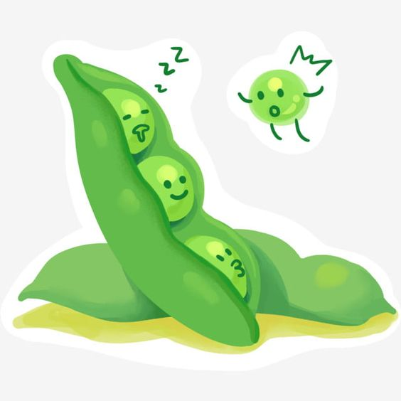

# 파이썬 챌린지
어제 학교 도서관에서 빌린 Nicola Lacey 의 <파이썬 챌린지> 이라는 책으로 공부를 시작했다.

파이썬 기본 문법은 배운지 꽤 되었고, 2년 전 쯤 고급 파이썬 프로그래밍 강의도 수강했지만

기억은 점점 흐려지고 실제로 프로그램을 만들어본 경험이 없어 

아직 파이썬을 할 줄 안다고 이야기하기도 민망한 수준이다.

간결한 문법 정리와 코드예제가 직관적으로 적혀있어 이제껏 배운 것들을 다시 복습하기에 적절한 것 같다.

어제, 오늘에 걸쳐 001~019 예제를 풀어봤다.

기초와 if문 문제였다.

아직 어렵지 않아서 초반에는 속도를 내는 게 좋겠다.

아직 Git이 익숙하지 않아 포스팅이 서툴다.

공부할 분야 별로 목차도 나누고, 이것저것 테마도 바꾸고 싶다.

차근차근 해봐야지!

내일은 공부한 소스코드를 첨부해봐야겠다.

-----------

'2024.03.08

아콩 이미지를 첨부해봤다! '

