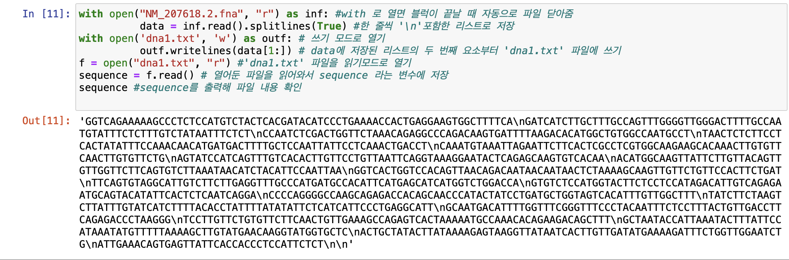
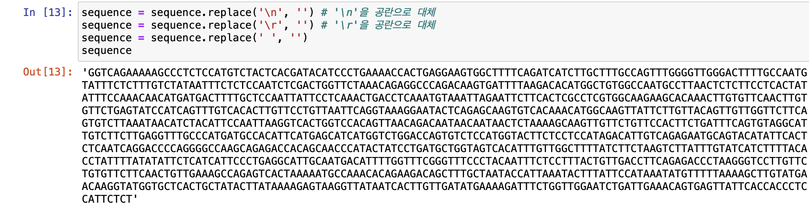
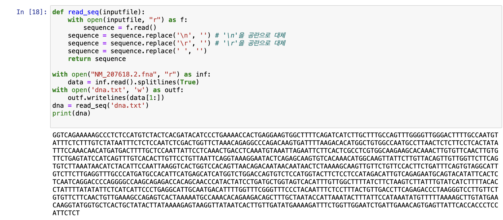

 ## 파이썬 스터디 2주차(빅데이터 분석)

1주차 스터디를 성황리에 마치고 2주차에 접어들었다.  

1주차는 파이썬 기본기를 다뤄서 크게 어려울 것이 없었는데

2주차부터는 난이도가 다소 높아질 것 같다.

앞으로의 포로그램은 주피터 노트북에서 실행할 예정이다.  

그럼 ... 시작 !!


---

## PART2 : 빅데이터 분석
### chapter8: DNA 프로젝트

인터넷에서 제공하는 DNA 서열을 다음의 표와 같이 아미노산 서열로 변환한다.


|    DNA    |      ATA     |      TGG      |      CAA       |
| :-------: | :----------: | :-----------: | :-------------:|
|   아미노산  |       I      |        W      |      Q         |

> 과제 진행 순서
 1. DNA와 프로틴 시퀀스 데이터를 수동 다운로드
 2. 파이썬으로 DNA 데이터를 열고 가공하기
 3. DNA를 아미노산으로 변환하는 알고리즘
 4. 변환한 아미노산 서열과 사이트에서 다운로드한 것이 일치하는지를 비교

#### 1. DNA와 프로틴 시퀀스 데이터를 수동 다운로드

NCBI에서 DNA시퀀스 파일을 다운로드 했다. 

파이썬의 open() 명령어를 이용해 다운로드 한 파일을 읽기 전용으로 연 후 출력했다.

```python
f = open("NM_207618.2.fna", "r")
sequence = f.read()
sequence
```

> 소스코드와 출력 결과  


파일을 열어보면 첫 번째 줄에 염기서열을 설명하는 내용이 있다. 

데이터를 분석하는 데 불필요하므로 삭제한다.

with open() 구문을 사용하면 해당 블록을 벗어났을 때 자동으로 파일을 닫아준다.

파일을 읽기 전용으로 열고, splitlines() 메소드를 이용해 줄 단위로 읽어들인다. 

splitlines()는 여러 줄의 문자열을 줄바꿈('\n')을 기준으로 나누며, 

각 줄의 내용을 요소로 갖는 리스트를 생성한다.

이 때, 매개변수가 True 라면 '\n'도 포함해서 리스트를 만든다. (False라면 줄바꿈 문자는 삭제)

소스코드를 작성해보자!

```python
with open("NM_207618.2.fna", "r") as inf: #with 로 열면 블럭이 끝날 때 자동으로 파일 닫아줌
          data = inf.read().splitlines(True) #한 줄씩 '\n'포함한 리스트로 저장
with open('dna1.txt', 'w') as outf: # 쓰기 모드로 열기
          outf.writelines(data[1:]) # data에 저장된 리스트의 두 번째 요소부터 'dna1.txt' 파일에 쓰기
f = open("dna1.txt", "r") #'dna1.txt' 파일을 읽기모드로 열기
sequence = f.read() # 열어둔 파일을 읽어와서 sequence 라는 변수에 저장
sequence #sequence를 출력해 파일 내용 확인
```

출력 결과를 보면 다음과 같다.



결과에는 '\n' 문자가 포함되어 있다.     

그러나 데이터 분석에는 필요하지 않으므로 replace()메소드를 이용해 삭제한다.

엔터키(Carriage return)나 혹시 모를 공란도 역시 삭제한다!



결과를 보면 깔끔히 삭제된 것을 볼 수 있다.
---

#### 2. DNA를 아미노산으로 변환하는 알고리즘

DNA에 대한 아미노산의 정보를 이용해 dna.txt의 내용을 아미노산 서열로 변환하는 작업이 필요하다.

```python
genetic_code = {
    'ATA':'I', 'ATC':'I', 'ATT':'I', 'ATG':'M',
    'ACA':'T', 'ACC':'T', 'ACG':'T', 'ACT':'T',
    'AAC':'N', 'AAT':'N', 'AAA':'K', 'AAG':'K',
    'AGC':'S', 'AGT':'S', 'AGA':'R', 'AGG':'R',
    'CTA':'L', 'CTC':'L', 'CTG':'L', 'CTT':'L',
    'CCA':'P', 'CCC':'P', 'CCG':'P', 'CCT':'P',
    'CAC':'H', 'CAT':'H', 'CAA':'Q', 'CAG':'Q',
    'CGA':'R', 'CGC':'R', 'CGG':'R', 'CGT':'R',
    'GTA':'V', 'GTC':'V', 'GTG':'V', 'GTT':'V',
    'GCA':'A', 'GCC':'A', 'GCG':'A', 'GCT':'A',
    'GAC':'D', 'GAT':'D', 'GAA':'E', 'GAG':'E',
    'GGA':'G', 'GGC':'G', 'GGG':'G', 'GGT':'G',
    'TCA':'S', 'TCC':'S', 'TCG':'S', 'TCT':'S',
    'TTC':'F', 'TTT':'F', 'TTA':'L', 'TTG':'L',
    'TAC':'Y', 'TAT':'Y', 'TAA':'_', 'TAG':'_' ,
    'TGC':'C', 'TGT':'C', 'TGA':'_', 'TGG':'W',
}
    
print(genetic_code['ATA'])
```


앞에서 연습한 내용을 바탕으로 다운로드 한 데이터를 가공하는 과정에서 공란, 개행문자, 엔터키를 파일에서 삭제한 후 새로운 파일에 저장하는 함수를 작성했다. 




이제 dna.txt 파일에 저장된 DNA 정보를 아미노산 시퀀스로 변환하는 코드를 작성한다. 

DNA코드를 3개씩 끊어서 1개의 아미노산 코드로 변환한다.

**그런데 NCBI 사이트에서 다운로드한 파일의 일부분만 아미노산의 DNA이므로 어느 부분이 여기에 해당하는지 조사해야 한다. 파일을 다운로드 한 페이지에서 찾아보면, 21..938 이라고 되어있는데, 이게 유전자의 코딩 시퀀스의 시작과 끝을 나타내는 위치다. 우리는 0에서부터 시작하는 배열을 사용하기 때문에 20~937 까지를 사용하면 된다.**

(참고: 리스트의 슬라이싱 기능을 활용해 sequence에 저장된 내용을 3개씩 가져올 수 있다. "sequence[0:3]")


```python
def convert(seq): #DNA시퀀스를 아미노산 시퀀스로 변환
    genetic_code = {
        'ATA':'I', 'ATC':'I', 'ATT':'I', 'ATG':'M',
        'ACA':'T', 'ACC':'T', 'ACG':'T', 'ACT':'T',
        'AAC':'N', 'AAT':'N', 'AAA':'K', 'AAG':'K',
        'AGC':'S', 'AGT':'S', 'AGA':'R', 'AGG':'R',
        'CTA':'L', 'CTC':'L', 'CTG':'L', 'CTT':'L',
        'CCA':'P', 'CCC':'P', 'CCG':'P', 'CCT':'P',
        'CAC':'H', 'CAT':'H', 'CAA':'Q', 'CAG':'Q',
        'CGA':'R', 'CGC':'R', 'CGG':'R', 'CGT':'R',
        'GTA':'V', 'GTC':'V', 'GTG':'V', 'GTT':'V',
        'GCA':'A', 'GCC':'A', 'GCG':'A', 'GCT':'A',
        'GAC':'D', 'GAT':'D', 'GAA':'E', 'GAG':'E',
        'GGA':'G', 'GGC':'G', 'GGG':'G', 'GGT':'G',
        'TCA':'S', 'TCC':'S', 'TCG':'S', 'TCT':'S',
        'TTC':'F', 'TTT':'F', 'TTA':'L', 'TTG':'L',
        'TAC':'Y', 'TAT':'Y', 'TAA':'_', 'TAG':'_' ,
        'TGC':'C', 'TGT':'C', 'TGA':'_', 'TGG':'W',
    }
    protein = ""
    if len(seq) % 3 == 0: # 데이터의 길이가 3의 배수이면 아래를 실행
        for i in range(0, len(seq), 3):
            codon = seq[i : i+3]
            protein += genetic_code[codon]
        return protein
print(convert(dna[20:938]))
```


위 소스코드의 출력 결과를 보면 'c' 다음에 '_' 문자가 출력되었다.

이는 EOF와 같은 종결 문자를 포함하기 때문이다.

그래서 마지막 3개 문자는 제외한다 !

```python
print(convert(dna[20:935]))
```


그럼 이렇게  올바른 결과를 얻을 수 있다.

지금까지 변환한 아미노산의 결과가 실제 결과와 동일한지 NCBI 사이트에서 확인해보면, 정확하다 !


이렇게 chapter8은 마무리하고 다음 포스팅에서는 chapter9로 넘어가보겠다.

---


