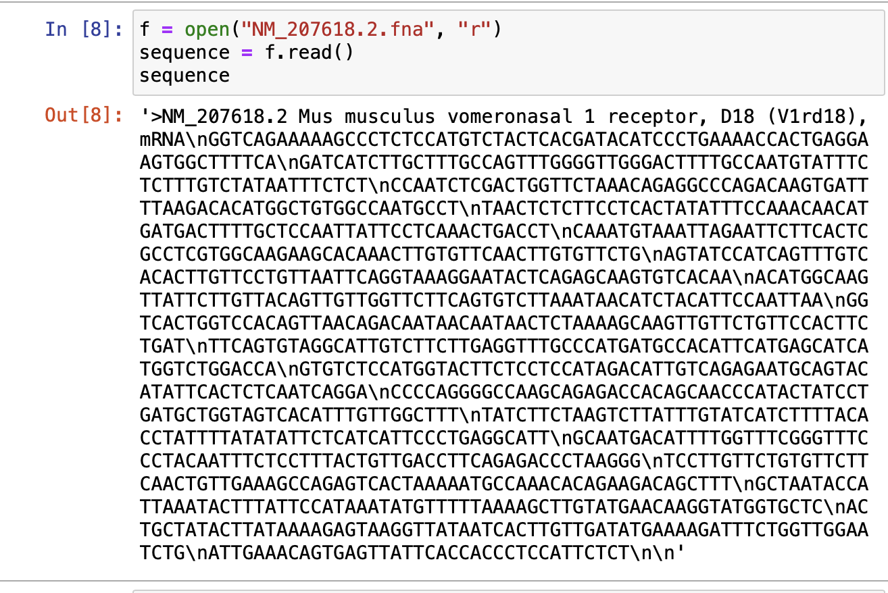

1주차 스터디를 성황리에 마치고 2주차에 접어들었다.  

1주차는 파이썬 기본기를 다뤄서 크게 어려울 것이 없었는데

2주차부터는 난이도가 다소 높아질 것 같다.

앞으로의 포로그램은 주피터 노트북에서 실행할 예정이다.  

그럼 ... 시작 !!


---

## PART2 : 빅데이터 분석
### chapter8: DNA 프로젝트

인터넷레서 제공하는 DNA 서열을 다음의 표와 같이 아미노산 서열로 변환한다.


|    DNA    |      ATA     |      TGG      |      CAA       |
| :-------: | :----------: | :-----------: | :-------------:|
|   아미노산  |       I      |        Q      |      Q         |

> 과제 진행 순서
- 1. DNA와 프로틴 시퀀스 데이터를 수동 다운로드
- 2. 파이썬으로 DNA 데이터를 열고 가공하기
- 3. DNA를 아미노산으로 변환하는 알고리즘
- 4. 변환한 아미노산 서열과 사이트에서 다운로드한 것이 일치하는지를 비교

#### 1. DNA와 프로틴 시퀀스 데이터를 수동 다운로드

NCBI에서 DNA시퀀스 파일을 다운로드 했다. 

파이썬의 open() 명령어를 이용해 다운로드 한 파일을 읽기 전용으로 연 후 출력했다.

```python
f = open("NM_207618.2.fna", "r")
sequence = f.read()
sequence
```

> 소스코드와 출력 결과



